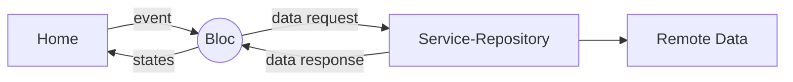
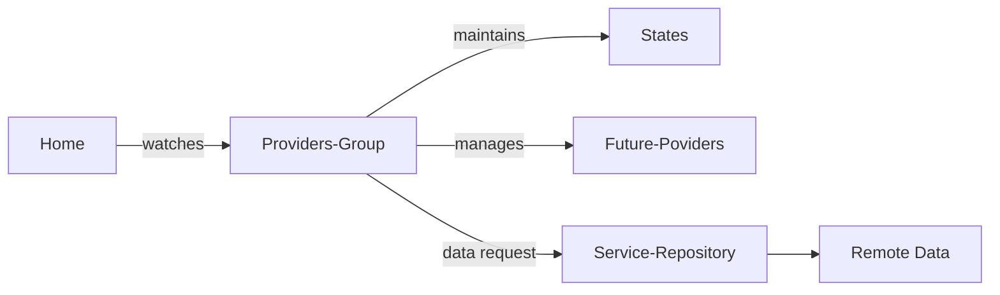

# Country-State  Selection  App

This Flutter app showcases retrieving country and state information from APIs, displaying them in dropdown menus, and enabling navigation to a new page based on the selected values.

## State Management
It has implemented two state management:
1.**Bloc**: (branch-> main)
2.**Riverpod**: (branch-> riverpod)

## Features

-   Fetches  country  list  using  API.
-   Dynamically  fetches  state  list  based  on  selected  country  using  API parameter.
-   Preserves  the  selected  country  and  state.
-   Navigates  to  a  new  page,  passing  the  selected  country  and  state.
-   Implements  state  management.
-   Focuses  on  clean  code  architecture.

## Snapshot


## Environment Setup
- create a json file key.json file with required keys
    - baseUrl
    - apiKey
    - userAgent
- add arguments before running app
```
--dart-define-from-file=keys.json
```
- finally run app
```
flutter run --dart-define-from-file=keys.json
```


## Bloc

Uses **flutter bloc** as a state management, making the code fast, easy to test, and reusable.

#### Dependencies

```
dependencies:
	dio: ^5.4.3+1 //network
	flutter_bloc: ^8.1.5 //bloc
	equatable: ^2.0.5 //comparision

dev_dependencies:
	bloc_test: ^9.1.7  //bloc test
	mocktail: ^1.0.3   //mock  
```

## Flow



## Structure
Reference [Flutter Modular](https://pub.dev/packages/flutter_modular)
```
lib/
  |- core/     # core configs
  |- network/   # Network service implementations
  |- models/    # Data models for Country and State
  |- bloc/   # bloc with event and states 
  |- view/   # UI screens 
  |- repository/   # Repository (abstract & usecases) 
  |- routes/   # Routes 
  |- main.dart  # App entry point
test
  |- mockservice
  |- unit test
```


> **Note:** Every structure is shown outside but its grouped by **Scope**


## Riverpod 2.0
Riverpod is a reactive caching framework for Flutter/Dart.

#### Dependencies

```
dependencies:
	dio: ^5.4.3+1 //network
	flutter_riverpod: ^2.5.1 //riverpod
	equatable: ^2.0.5 //comparision

dev_dependencies:
	custom_lint: ^0.6.4  //custom lint
	riverpod_lint: ^2.3.10  // predefined riverpod lint
```


## Flow(Draft)




## Structure
Reference [Flutter Modular](https://pub.dev/packages/flutter_modular)
```
lib/
  |- core/     # core configs
  |- network/   # Network service implementations
  |- models/    # Data models for Country and State
  |- providers/   # providers 
  |- view/   # UI screens 
  |- repository/   # Repository (abstract & usecases) 
  |- routes/   # Routes 
  |- main.dart  # App entry point
```


>Note : Use freezed for auto code generation and **immutability**.